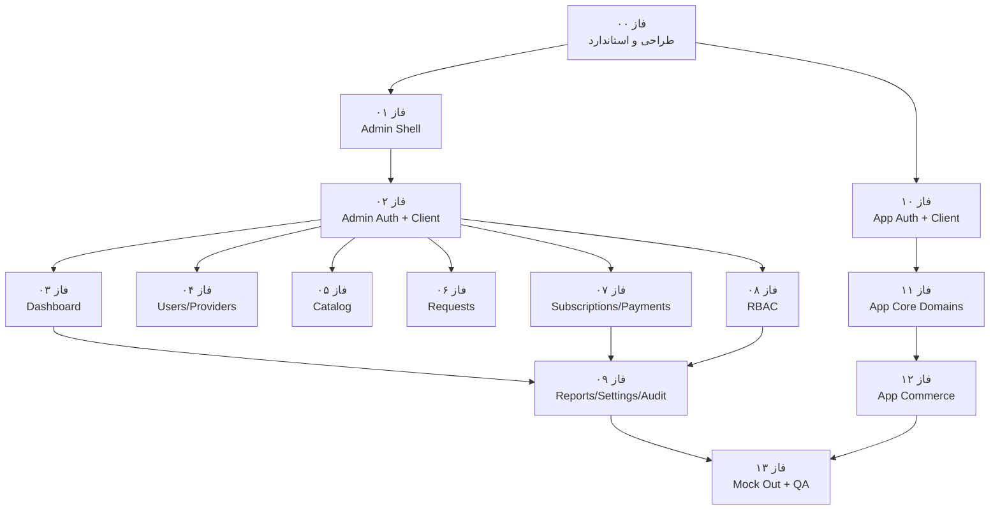

# نقشه‌راه پنل مدیریت + اتصال Frontend به API واقعی

> **وضعیت سند:** Frontend Real پیاده‌سازی و فاز ۱۳ بسته شده است (Mock بازنشسته؛ ادمین + اپ روی API/DB واقعی).  
> **مراجع اصلی:**  
> - [`docs/project-prd.md`](../project-prd.md)  
> - [`docs/database.schema`](../database.schema)  
> - [`docs/api-tasks/`](../api-tasks/) و [`docs/api-tasks/endpoint-catalog.md`](../api-tasks/endpoint-catalog.md)  
> - [`docs/openapi/openapi.json`](../openapi/openapi.json)  
> - اپ واقعی در `next/src/app/{users,providers,auth}` و پنل در `next/src/app/admins`  
> **Backend:** `/api/app/v1` و `/api/admins/v1` روی Next.js 16 + Prisma 7 + MySQL  
> **Frontend:** پنل ادمین حرفه‌ای + اپ Consumer/Provider روی API واقعی

---

## هدف

این نقشه‌راه مسیر **طراحی UI/UX پنل ادمین**، **اتصال ادمین و اپ به دیتابیس/API واقعی** و **بازنشستگی لایه Mock** را فازبندی کرد و اجرا شد.

دو خط موازی ولی وابسته:

| خط | شرح |
|---|---|
| **A — Admin Console** | طراحی و پیاده‌سازی پنل مدیریت حرفه‌ای روی `/admins` و اتصال به `/api/admins/v1` |
| **B — App Real Data** | جایگزینی Mock در `/auth`، `/users`، `/providers` با `/api/app/v1` و داده واقعی |

> پنل ادمین و اپ هر دو روی API/DB واقعی هستند؛ تغییرات بعدی enhancement نسخه‌ای است.

## تصمیم‌های قطعی

| موضوع | تصمیم |
|---|---|
| مسیر ادمین | `/admins/...` (جدا از `/users` و `/providers`) |
| Auth ادمین | موبایل + رمز؛ cookie HttpOnly جدا از نشست کاربر |
| Auth اپ | موبایل ایرانی + OTP؛ cookie/session واقعی |
| شناسه در UI | فقط `public_id` (ULID)؛ بدون id داخلی |
| لیست‌های سنگین | Cursor pagination (`cursor` + `limit`) مطابق قرارداد API |
| حجم صفحه پیش‌فرض | `limit=20`؛ سقف `100` |
| فیلتر | Query string mirror روی URL برای share/reload |
| RBAC در UI | مخفی‌سازی منو/اکشن بر اساس `permission codes`؛ کنترل نهایی همیشه در API |
| تاریخ | ذخیره/API = UTC ISO؛ نمایش شمسی فقط در Client |
| مبلغ | integer تومان؛ بدون float |
| استک UI | Next.js 16 App Router · React 19 · Tailwind 4 · shadcn/ui · Zod 4 · Zustand (thin client state) |
| الگوی داده Client | API Client تایپ‌شده + cache سبک؛ Zustand فقط برای UI/session preference نه source-of-truth دامنه |
| جداسازی Mock | لایه `lib/mock` بازنشسته؛ گارد CI/ESLint مانع بازگشت است |

## نمای کلی فازها

| فاز | عنوان | خط | وابستگی | خروجی کلیدی |
|---|---|---|---|---|
| ۰۰ | [طراحی سیستم، IA و استانداردها](./phase-00-planning-design-system/) | A+B | — | Design System ادمین، IA، استاندارد فیلتر/صفحه‌بندی |
| ۰۱ | [Shell ادمین و Foundation](./phase-01-admin-shell-foundation/) | A | ۰۰ | Layout Metronic-like، DataTable، FilterBar |
| ۰۲ | [Auth ادمین و API Client](./phase-02-admin-auth-api-client/) | A | ۰۱ | Login، session، RBAC gate، typed client |
| ۰۳ | [Dashboard و Ops](./phase-03-dashboard-ops/) | A | ۰۲ | KPI، متریک، ورود سریع عملیاتی |
| ۰۴ | [کاربران و Providerها](./phase-04-users-providers/) | A | ۰۲ | لیست/جزئیات/moderation با فیلتر حرفه‌ای |
| ۰۵ | [کاتالوگ](./phase-05-catalog/) | A | ۰۲ | مدیریت دسته/خدمت و reorder |
| ۰۶ | [درخواست‌ها](./phase-06-service-requests/) | A | ۰۲ | مداخله مدیریتی روی چرخه Request |
| ۰۷ | [اشتراک و پرداخت](./phase-07-subscriptions-payments/) | A | ۰۲ | پلن، grant/cancel، payment/refund |
| ۰۸ | [مدیران و RBAC](./phase-08-rbac-admins/) | A | ۰۲ | Admins، Roles، Overrides |
| ۰۹ | [گزارش، تنظیمات، Audit، اعلان](./phase-09-reports-settings-audit/) | A | ۰۳+۰۷ | گزارش مالی، settings، audit، notification admin |
| ۱۰ | [API Client اپ و Auth واقعی](./phase-10-app-api-client-auth/) | B | ۰۰ | OTP واقعی، session اپ، حذف MOCK_OTP از مسیر اصلی |
| ۱۱ | [دامنه‌های اصلی اپ](./phase-11-app-core-domains/) | B | ۱۰ | پروفایل، کاتالوگ، زمین، Provider، جستجو، درخواست |
| ۱۲ | [تجارت، اعلان و گزارش اپ](./phase-12-app-commerce-notifications/) | B | ۱۱ | اشتراک، پرداخت، اعلان، گزارش |
| ۱۳ | [بازنشستگی Mock، QA و انتشار](./phase-13-mock-retirement-qa-release/) | A+B | ۰۹+۱۲ | حذف Mock، E2E، performance، release checklist |

## نمودار وابستگی

> فازهای ادمین ۰۴ تا ۰۸ پس از ۰۲ می‌توانند موازی اجرا شوند. خط اپ (۱۰–۱۲) می‌تواند موازی با خط ادمین پیش برود.

## اسناد مرجع این نقشه‌راه

- [کاتالوگ صفحات ادمین و اپ](./screen-catalog.md)
- [نگاشت UI به Endpoint و Permission](./api-ui-mapping.md)
- [اصول UX پنل ادمین (سطح Metronic)](./ux-design-principles.md)
- [استاندارد صفحه‌بندی، فیلتر و عملکرد لیست‌ها](./pagination-filtering-standard.md)
- [ماتریس مهاجرت Mock → API](./mock-to-api-migration-matrix.md)

## قواعد اجرای فازها

1. هیچ صفحه‌ای بدون اتصال به قرارداد OpenAPI/`endpoint-catalog` ساخته نمی‌شود (جز scaffold خالص فاز ۰۱).
2. لیست‌های production باید cursor-based باشند؛ offset/page number ممنوع مگر API صریحاً پشتیبانی کند (در حال حاضر ندارد).
3. فیلترهای مهم باید در URL همگام شوند تا refresh/share کار کند.
4. اکشن‌های حساس (ban، refund، cancel request، grant subscription، تغییر نقش) همیشه confirmation + reason دارند.
5. UI فقط `public_id` نشان می‌دهد و می‌فرستد.
6. مخفی‌سازی دکمه جایگزین authorization نیست؛ API باید 403 بدهد و UI آن را درست نشان دهد.
7. اپ موبایل‌محور و ادمین دسکتاپ‌محور design language جدا دارند؛ فقط tokens پایه (رنگ برند، فونت) مشترک می‌مانند.
8. مسیرهای runtime از `lib/mock` خارج شده‌اند (فاز ۱۳ + گارد CI).
9. هر فاز فقط بعد از معیار پذیرش همان فاز بسته می‌شود.

## Definition of Done کل پروژه Frontend Real

- [x] پنل `/admins` با UX حرفه‌ای (sidebar، toolbar، filter، DataTable، detail drawer/page) کامل است.
- [x] تمام endpointهای مدیریتی کاتالوگ‌شده که UI دارند، از پنل قابل استفاده و permission-aware هستند.
- [x] تمام جریان‌های اپ Consumer/Provider روی API واقعی و دیتابیس کار می‌کنند.
- [x] صفحه‌بندی cursor در لیست‌های پرترافیک ادمین و اپ پیاده شده و با دیتای زیاد کند نمی‌شود.
- [x] فیلترهای کلیدی Users، Providers، Requests، Payments، Audit کامل و URL-synced هستند.
- [x] لایه Mock از مسیر production حذف شده است.
- [x] E2E اصلی ادمین و اپ (smoke + RBAC منفی + RTL) سبز است؛ RTL/Vazirmatn بدون شکستگی است. چرخه کامل دامنه با integration سرور (`phase07`/`phase08`/`phase06`) و smoke دستی تأیید می‌شود.
- [x] هیچ secret، internal id، hash یا مختصات غیرمجاز در UI لو نمی‌رود.

## پس از اتمام

1. برای deploy از [`release-runbook.md`](./phase-13-mock-retirement-qa-release/release-runbook.md) استفاده کنید.
2. گاردها: `pnpm release:check` (و در صورت نیاز `RELEASE_E2E=1`).
