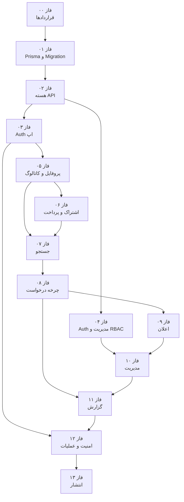

# نقشه‌راه طراحی و پیاده‌سازی API — پلتفرم کشاورز

> **وضعیت سند:** برنامه اجرایی؛ در این مرحله هیچ API یا Migration پیاده‌سازی نمی‌شود.  
> **مراجع اصلی:** [`docs/project-prd.md`](../project-prd.md) و [`docs/database.schema`](../database.schema)  
> **پایگاه داده:** MySQL 8.0.16+  
> **ORM و Migration:** Prisma ORM + Prisma Migrate  
> **Backend:** Next.js App Router Route Handlers  
> **قرارداد مسیر:** `/api/app/v1/...` برای اپلیکیشن و `/api/admins/v1/...` برای مدیریت

---

## هدف

این نقشه‌راه، توسعه Backend را از آماده‌سازی Prisma و Migrationهای افزایشی تا انتشار API، امنیت، تست و مانیتورینگ فازبندی می‌کند. هر فاز باید مستقل بازبینی شود و فقط بعد از تأیید معیارهای پذیرش، فاز بعدی شروع شود.

> فایل صحیح PRD در پروژه `docs/project-prd.md` است؛ نام `docs/projcts-prd.md` که در درخواست ذکر شده وجود ندارد.

## تصمیم‌های معماری قطعی

| موضوع | تصمیم |
|---|---|
| نسخه API | نسخه در URL و شروع با `v1` |
| API اپ | `/api/app/v1` |
| API مدیریت | `/api/admins/v1` |
| شناسه عمومی | فقط `public_id` از نوع ULID در API؛ شناسه عددی داخلی افشا نشود |
| احراز هویت کاربر | موبایل ایرانی + OTP پیامکی |
| احراز هویت مدیر | موبایل + رمز عبور؛ بدون OTP |
| نشست‌ها | توکن تصادفی opaque، ذخیره hash در DB، Cookie امن و HttpOnly |
| مجوز مدیریت | RBAC با نقش، Permission و overrideهای allow/deny |
| اعتبارسنجی | Zod در مرز HTTP و اعتبارسنجی مجدد قواعد کسب‌وکار در Service |
| تاریخ/زمان | ذخیره UTC؛ پاسخ ISO 8601؛ تبدیل شمسی فقط در Client |
| مبلغ | عدد صحیح تومان؛ بدون float |
| تراکنش | عملیات چندجدولی و transitionهای درخواست داخل تراکنش |
| مستندسازی | OpenAPI 3.1 به‌عنوان قرارداد قابل تست |

## نمای کلی فازها

| فاز | عنوان | وابستگی | خروجی کلیدی |
|---|---|---|---|
| ۰۰ | [معماری و قراردادها](./phase-00-api-architecture-contracts/) | — | قرارداد HTTP، امنیت، خطا و نسخه‌بندی |
| ۰۱ | [زیرساخت Prisma و Migration](./phase-01-prisma-database-foundation/) | ۰۰ | Prisma Schema، baseline و Migration افزایشی |
| ۰۲ | [زیرساخت مشترک API](./phase-02-shared-api-infrastructure/) | ۰۱ | ساختار لایه‌ای، validation، error و idempotency |
| ۰۳ | [احراز هویت اپ](./phase-03-app-authentication/) | ۰۲ | OTP، نشست کاربر و پروفایل جاری |
| ۰۴ | [احراز هویت مدیریت و RBAC](./phase-04-admin-authentication-rbac/) | ۰۲ | login مدیر، guard مجوز و audit |
| ۰۵ | [پروفایل، کاتالوگ، زمین و خدمات](./phase-05-app-profile-catalog-lands-provider-services/) | ۰۳ | APIهای پایه Consumer و Provider |
| ۰۶ | [اشتراک و پرداخت](./phase-06-subscriptions-payments/) | ۰۵ | پلن، خرید، callback و تاریخچه |
| ۰۷ | [جستجو و تطبیق](./phase-07-search-matching/) | ۰۵ + ۰۶ | جستجوی امن Provider براساس خدمت و فاصله |
| ۰۸ | [چرخه کامل درخواست](./phase-08-request-lifecycle/) | ۰۷ | ارسال، قبول، رد، لغو و پایان کار |
| ۰۹ | [اعلان‌ها](./phase-09-notifications/) | ۰۸ | اعلان درون‌برنامه‌ای و ارسال async |
| ۱۰ | [API کامل مدیریت](./phase-10-admin-management-api/) | ۰۴ + ۰۹ | مدیریت کاربران، محتوا، درخواست و مالی |
| ۱۱ | [گزارش و تحلیل](./phase-11-reports-analytics/) | ۰۸ + ۱۰ | گزارش‌های اپ و مدیریت، export |
| ۱۲ | [امنیت، Job و مشاهده‌پذیری](./phase-12-security-jobs-observability/) | ۰۳ تا ۱۱ | hardening، scheduler، log و alert |
| ۱۳ | [تست، OpenAPI و انتشار](./phase-13-testing-openapi-release/) | همه فازها | تست نهایی، مستندات و runbook انتشار |

## نمودار وابستگی

## اسناد مرجع این نقشه‌راه

- [کاتالوگ کامل Endpointها](./endpoint-catalog.md)
- [نگاشت دیتابیس به API و فازها](./database-api-mapping.md)
- [خط‌مشی امنیت و احراز هویت](./security-baseline.md)
- [خط‌مشی Migration افزایشی Prisma](./phase-01-prisma-database-foundation/incremental-migration-policy.md)
- [تراکنش‌ها و ماشین وضعیت درخواست](./phase-08-request-lifecycle/transaction-state-machine.md)

## قواعد اجرای فازها

1. Migration اعمال‌شده هرگز ویرایش یا حذف نمی‌شود.
2. هر تغییر DB در Migration جدید، کوچک، نام‌دار و قابل بازبینی ثبت می‌شود.
3. Route Handler فقط HTTP را مدیریت می‌کند؛ قواعد کسب‌وکار در Service قرار می‌گیرند.
4. دسترسی داده فقط از Repository/Prisma gateway انجام می‌شود.
5. تمام endpointهای خصوصی باید authentication، authorization و ownership check داشته باشند.
6. تغییرات حساس مدیریت باید در `admin_audit_logs` ثبت شوند.
7. هیچ پاسخ API نباید hash رمز، OTP، session token، شناسه داخلی یا مختصات غیرمجاز را افشا کند.
8. هر endpoint پیش از تکمیل، schema ورودی/خروجی، تست و OpenAPI contract دارد.

## Definition of Done کل پروژه Backend

- [ ] تمام endpointهای `endpoint-catalog.md` پیاده‌سازی و مستند شده‌اند.
- [ ] Prisma schema با `docs/database.schema` هم‌پوشانی کامل دارد.
- [ ] دیتابیس خالی با Migrationها از صفر ساخته می‌شود.
- [ ] baseline برای دیتابیس از قبل موجود مستند و آزمایش شده است.
- [ ] OTP کاربر و login رمزدار مدیر کاملاً جدا هستند.
- [ ] RBAC و audit log برای تمام عملیات مدیریت فعال است.
- [ ] BR-01 تا BR-09 در تراکنش و تست‌های concurrency پوشش دارند.
- [ ] OpenAPI، integration test، E2E و runbook انتشار تأیید شده‌اند.
- [ ] هیچ Migration یا API خارج از فاز مصوب به‌صورت هم‌زمان اجرا نشده است.
