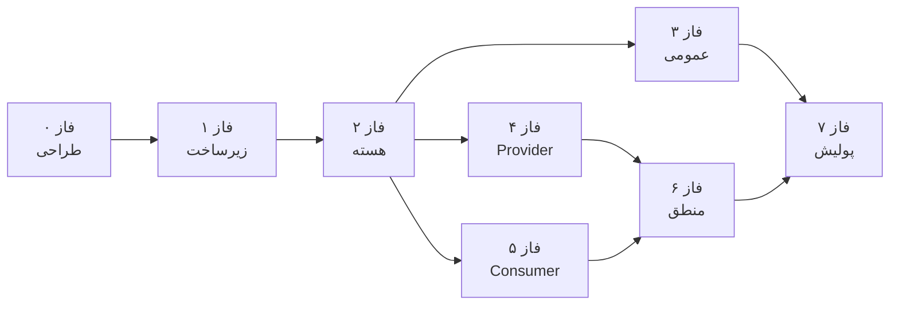

# نقشه راه پیاده‌سازی — اپلیکیشن کشاورز (Mock)

> **مرجع:** [project-prd.md](../project-prd.md)  
> **هدف:** فازبندی کامل فرایند طراحی و توسعه Mock از صفر تا تحویل  
> **استک:** Next.js 16 · React 19 · shadcn/ui · Tailwind 4 · Zustand · Zod · PWA

---

## نمای کلی فازها

| فاز | عنوان | پوشه | وابستگی | خروجی کلیدی |
|-----|--------|------|---------|-------------|
| **۰** | برنامه‌ریزی و طراحی | [phase-00-planning-design](./phase-00-planning-design/) | — | Design System + IA + استراتژی Mock |
| **۱** | زیرساخت و Scaffold | [phase-01-foundation](./phase-01-foundation/) | فاز ۰ | پروژه Next.js آماده + Mobile Shell |
| **۲** | هسته پلتفرم | [phase-02-core-platform](./phase-02-core-platform/) | فاز ۱ | Types · Stores · Auth · کامپوننت‌های مشترک |
| **۳** | صفحات عمومی | [phase-03-landing-public](./phase-03-landing-public/) | فاز ۲ | Landing · آب‌وهوا · پروفایل |
| **۴** | پنل خدمات‌دهنده | [phase-04-provider-panel](./phase-04-provider-panel/) | فاز ۲ | ۵ صفحه + Dock Provider |
| **۵** | پنل خدمات‌گیرنده | [phase-05-consumer-panel](./phase-05-consumer-panel/) | فاز ۲ | ۶ صفحه + Dock Consumer |
| **۶** | منطق کسب‌وکار | [phase-06-business-logic](./phase-06-business-logic/) | فاز ۴ + ۵ | State Machine · جستجو · حریم تماس |
| **۷** | یکپارچه‌سازی و پولیش | [phase-07-integration-polish](./phase-07-integration-polish/) | فاز ۶ | E2E · QA · UI نهایی |

---

## نمودار وابستگی فازها



> **نکته:** فاز ۴ و ۵ می‌توانند **موازی** پیش بروند پس از اتمام فاز ۲.

---

## ترتیب پیشنهادی اجرا

### مسیر خطی (یک نفر)

```
۰ → ۱ → ۲ → ۳ → ۴ → ۵ → ۶ → ۷
```

### مسیر موازی (دو نفر)

| نفر A | نفر B |
|-------|-------|
| ۰ → ۱ → ۲ → ۳ | — |
| ۴ (Provider) | ۵ (Consumer) |
| ۶ (منطق مشترک) | ۶ (منطق مشترک) |
| ۷ (پولیش) | ۷ (پولیش) |

---

## ساختار پوشه‌ها

```
docs/app-tasks/
├── README.md                          ← این فایل
├── phase-00-planning-design/
├── phase-01-foundation/
├── phase-02-core-platform/
├── phase-03-landing-public/
├── phase-04-provider-panel/
├── phase-05-consumer-panel/
├── phase-06-business-logic/
└── phase-07-integration-polish/
```

---

## قالب هر سند تسک

هر فایل تسک شامل این بخش‌هاست:

| بخش | توضیح |
|-----|--------|
| **هدف** | چرا این مرحله لازم است |
| **پیش‌نیاز** | فاز/تسک‌های وابسته |
| **تسک‌ها** | چک‌لیست قابل اجرا |
| **فایل‌های خروجی** | مسیر فایل‌های ایجادشده |
| **معیار پذیرش** | Definition of Done |
| **نکات طراحی** | الزامات UI/UX |

---

## تخمین زمان (Mock — توسعه‌دهنده متوسط)

| فاز | تخمین |
|-----|--------|
| ۰ | ۱–۲ روز |
| ۱ | ۱–۲ روز |
| ۲ | ۲–۳ روز |
| ۳ | ۱ روز |
| ۴ | ۳–۴ روز |
| ۵ | ۳–۴ روز |
| ۶ | ۲–۳ روز |
| ۷ | ۲ روز |
| **جمع** | **~۱۵–۲۱ روز کاری** |

---

## چک‌لیست نهایی تحویل Mock

- [ ] تمام مسیرهای PRD پیاده‌سازی شده
- [ ] جریان جستجو → درخواست → قبول → پایان کار E2E کار می‌کند
- [ ] ۱۰۰٪ قوانین BR (بخش ۱۲ PRD) رعایت شده
- [ ] قاب موبایل در viewport بزرگ حفظ می‌شود
- [ ] PWA قابل نصب است
- [ ] RTL + Vazirmatn بدون مشکل
- [ ] Empty State و Loading در تمام لیست‌ها
- [ ] Toast برای تمام اقدامات کاربر

---

## شروع کار

1. فاز ۰ را کامل کنید → [phase-00-planning-design/README.md](./phase-00-planning-design/README.md)
2. سپس فاز ۱ → [phase-01-foundation/README.md](./phase-01-foundation/README.md)
3. پس از هر فاز، چک‌لیست README همان فاز را تأیید کنید
