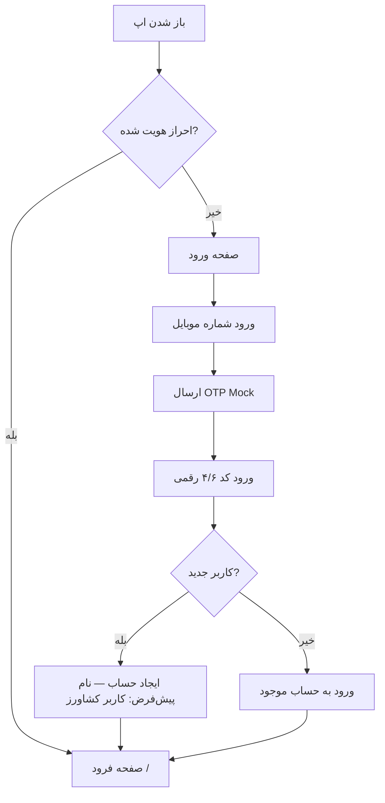
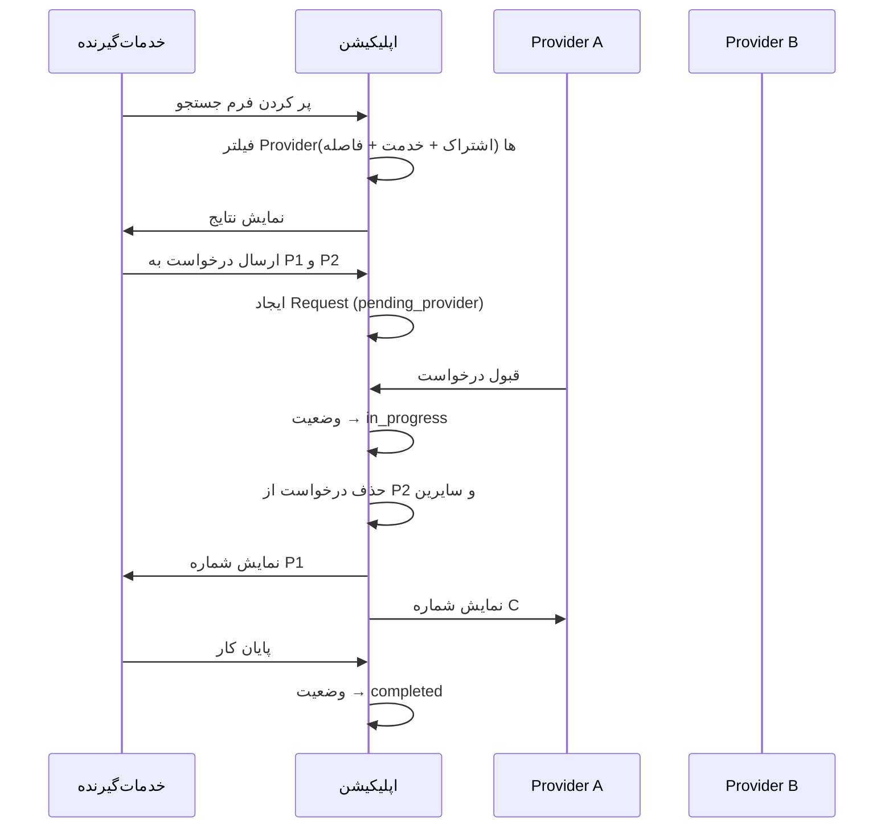
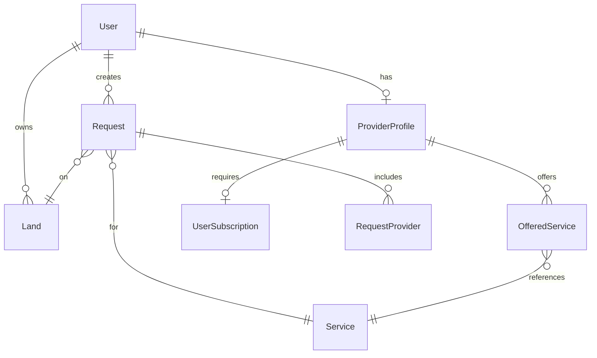
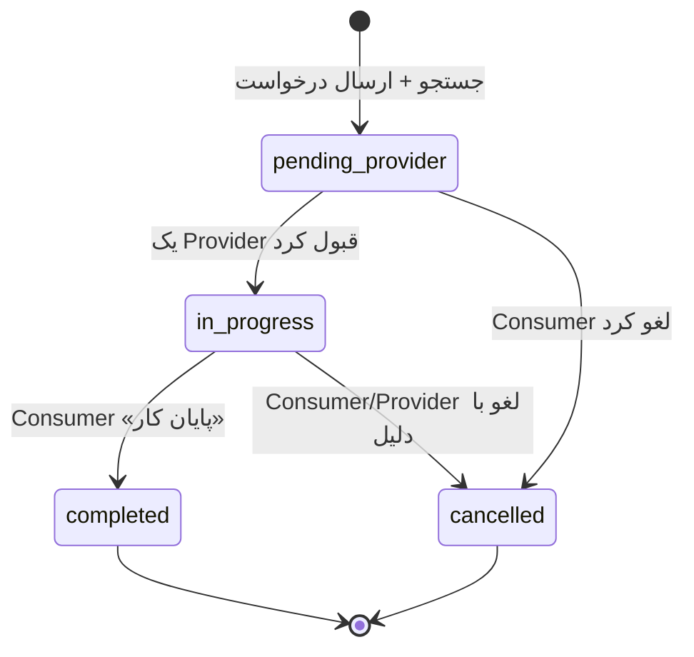

# PRD — کشاورز (Keshavarz)

| فیلد | مقدار |
|------|--------|
| **نسخه سند** | 1.0.0 |
| **تاریخ** | ۱۴۰۴/۰۴/۲۰ (۲۰۲۵-۰۷-۱۱) |
| **وضعیت** | پیش‌نویس تأییدشده برای فاز Mock |
| **مالک محصول** | تیم کشاورز |
| **مخاطب سند** | طراحی، توسعه، QA، ذی‌نفعان محصول |

---

## فهرست مطالب

1. [خلاصه اجرایی](#۱-خلاصه-اجرایی)
2. [چشم‌انداز و اهداف](#۲-چشم‌انداز-و-اهداف)
3. [کاربران هدف و پرسونا](#۳-کاربران-هدف-و-پرسونا)
4. [دامنه محصول و محدودیت‌ها](#۴-دامنه-محصول-و-محدودیت‌ها)
5. [معماری محصول](#۵-معماری-محصول)
6. [احراز هویت و مدیریت کاربر](#۶-احراز-هویت-و-مدیریت-کاربر)
7. [صفحه فرود (Landing)](#۷-صفحه-فرود-landing)
8. [بخش خدمات‌دهنده (Provider)](#۸-بخش-خدمات‌دهنده-provider)
9. [بخش خدمات‌گیرنده (Consumer)](#۹-بخش-خدمات‌گیرنده-consumer)
10. [جریان‌های کلیدی کاربر](#۱۰-جریان‌های-کلیدی-کاربر)
11. [مدل داده و موجودیت‌ها](#۱۱-مدل-داده-و-موجودیت‌ها)
12. [قوانین کسب‌وکار و ماشین وضعیت](#۱۲-قوانین-کسب‌وکار-و-ماشین-وضعیت)
13. [الگوریتم جستجو و تطبیق](#۱۳-الگوریتم-جستجو-و-تطبیق)
14. [طراحی UI/UX](#۱۴-طراحی-uiux)
15. [الزامات فنی](#۱۵-الزامات-فنی)
16. [فاز Mock — دامنه پیاده‌سازی](#۱۶-فاز-mock--دامنه-پیاده‌سازی)
17. [معیارهای موفقیت](#۱۷-معیارهای-موفقیت)
18. [ریسک‌ها و وابستگی‌ها](#۱۸-ریسک‌ها-و-وابستگی‌ها)
19. [واژه‌نامه](#۱۹-واژه‌نامه)
20. [پیوست: نقشه مسیرها](#۲۰-پیوست-نقشه-مسیرها)

---

## ۱. خلاصه اجرایی

**کشاورز** یک پلتفرم موبایل‌محور (PWA) در حوزه کشاورزی است که دو نقش اصلی را در یک اپلیکیشن واحد پوشش می‌دهد:

- **خدمات‌دهنده:** کشاورزی که ادوات و خدمات کشاورزی دارد و می‌خواهد درآمد کسب کند.
- **خدمات‌گیرنده:** کشاورزی که به خدمات یا ادوات نیاز دارد و آن‌ها را جستجو و درخواست می‌کند.

هسته ارزش محصول: **تطبیق مکانی خدمات کشاورزی** بر اساس موقعیت جغرافیایی، نوع خدمت، قیمت و وضعیت اشتراک خدمات‌دهنده — همراه با مدیریت چرخه کامل درخواست از جستجو تا اتمام کار.

این سند PRD نسخه **Mock** را تعریف می‌کند: رابط کاربری کامل، داده‌های شبیه‌سازی‌شده، و منطق کسب‌وکار سمت کلاینت بدون اتصال به بک‌اند واقعی، SMS، نقشه زنده یا درگاه پرداخت.

---

## ۲. چشم‌انداز و اهداف

### ۲.۱ چشم‌انداز

تبدیل شدن به مرجع اصلی اتصال کشاورزان ایرانی برای اشتراک‌گذاری ادوات و خدمات کشاورزی در محدوده جغرافیایی مشخص — با تجربه‌ای شبیه اپلیکیشن موبایل بومی، ساده و قابل اعتماد.

### ۲.۲ اهداف محصول (فاز Mock)

| هدف | توضیح |
|-----|--------|
| **اعتبارسنجی UX** | نمایش کامل جریان‌های اصلی برای تست با کاربران واقعی |
| **یکپارچگی دو نقش** | اثبات اینکه یک کاربر می‌تواند همزمان Provider و Consumer باشد |
| **شفافیت فرایند درخواست** | پیاده‌سازی دقیق چرخه درخواست و قوانین نمایش اطلاعات تماس |
| **تجربه موبایل حرفه‌ای** | حفظ قاب موبایل در تمام اندازه‌های صفحه نمایش |
| **آمادگی برای فاز بعد** | ساختار ماژولار برای اتصال آینده به API، SMS، نقشه و پرداخت |

### ۲.۳ اهداف غیرمحصولی (فاز Mock)

- Next.js 16 + React 19 + shadcn/ui + Tailwind CSS 4
- PWA قابل نصب روی موبایل
- RTL کامل و فونت Vazirmatn
- داده Mock در localStorage / Zustand

---

## ۳. کاربران هدف و پرسونا

### ۳.۱ کاربران هدف

| گروه | نیاز اصلی |
|------|-----------|
| کشاورز دارای ادوات (تراکتور، کمباین، سم‌پاش و …) | کسب درآمد از ادوات بلااستفاده |
| کشاورز بدون ادوات یا با زمین محدود | دسترسی به خدمات با قیمت و فاصله شفاف |
| کشاورز ترکیبی | هم ارائه خدمت و هم دریافت خدمت |

### ۳.۲ پرسونا

**علی — خدمات‌دهنده**
- ۴۲ ساله، مالک تراکتور و کمباین در استان خوزستان
- محدوده کاری ۵۰ کیلومتر
- نیاز: مدیریت درخواست‌ها، گزارش درآمد، اشتراک ماهانه

**زهرا — خدمات‌گیرنده**
- ۳۵ ساله، مالک ۳ زمین کشاورزی
- نیاز: جستجوی خدمات کاشت/برداشت نزدیک زمین، مقایسه قیمت، پیگیری وضعیت کار

---

## ۴. دامنه محصول و محدودیت‌ها

### ۴.۱ در دامنه (In Scope — Mock)

- ورود دو مرحله‌ای Mock با شماره موبایل
- صفحه فرود با تاریخ، ساعت و آب‌وهوا
- دو پنل مستقل Provider و Consumer با Dock Navigation
- مدیریت محدوده کاری و خدمات قابل ارائه
- مدیریت زمین‌ها
- جستجوی خدمات با فیلتر و مرتب‌سازی
- چرخه کامل درخواست (۴ وضعیت + جزئیات)
- گزارشات مالی Mock (نمودار)
- مدیریت اشتراک Mock
- نقشه Mock (انتخاب موقعیت شبیه‌سازی‌شده)
- تقویم Mock برای انتخاب تاریخ‌های انجام کار

### ۴.۲ خارج از دامنه (Out of Scope — Mock)

- SMS واقعی و OTP Provider
- نقشه ماهواره‌ای زنده (Google Maps / Mapbox)
- درگاه پرداخت واقعی
- چت درون‌برنامه‌ای
- اعلان Push واقعی
- پنل ادمین
- امتیازدهی و نظرات
- احراز هویت KYC / مدارک
- چندزبانه (فقط فارسی)

---

## ۵. معماری محصول

### ۵.۱ ساختار کلی

```
site.com/
├── /                          → Landing (فرود)
├── /auth                      → ورود / ثبت‌نام OTP
├── /providers/                 → پنل خدمات‌دهنده
│   ├── home                   → داشبورد
│   ├── services               → خدمات من
│   ├── requests               → درخواست‌ها
│   ├── requests/[id]          → جزئیات درخواست
│   ├── reports                → گزارشات مالی
│   └── subscription           → اشتراک‌ها
└── /users/                    → پنل خدمات‌گیرنده
    ├── home                   → داشبورد
    ├── lands                  → زمین‌های من
    ├── requests               → درخواست‌ها
    ├── requests/[id]          → جزئیات درخواست
    ├── search                 → جستجوی خدمات
    ├── search/results         → نتایج جستجو
    └── reports                → گزارشات مالی
```

### ۵.۱.۱ قرارداد URL پنل‌ها

| پنل | پیشوند URL | نمونه |
|-----|------------|-------|
| **خدمات‌دهنده (Provider)** | `/providers` | `site.com/providers/requests` |
| **خدمات‌گیرنده (Consumer)** | `/users` | `site.com/users/lands` |

> **نکته:** نام‌های Provider و Consumer در مستندات و کد (types، stores) به‌عنوان نقش کاربری باقی می‌مانند؛ فقط **مسیرهای عمومی (URL)** از `/providers` و `/users` استفاده می‌کنند.

**نگاشت App Router:**

| URL | پوشه Next.js |
|-----|-------------|
| `/providers/*` | `src/app/providers/` |
| `/users/*` | `src/app/users/` |

### ۵.۲ اصل «دو اپ در یک اپ»

هر بخش (Provider / Consumer) دارای:
- **Layout مستقل** با Dock ثابت پایین
- **صفحه Home مستقل** (داشبورد)
- **ناوبری و state جدا** (در Mock با Zustand store تفکیک‌شده)

کاربر پس از احراز هویت می‌تواند آزادانه بین دو بخش جابه‌جا شود؛ هیچ محدودیتی برای استفاده همزمان وجود ندارد.

### ۵.۳ قاب موبایل (Mobile Shell)

| الزام | جزئیات |
|------|--------|
| عرض حداکثر | `max-width: 430px` (یا معادل iPhone 14 Pro Max) |
| مرکزچین | در viewportهای بزرگ، اپ در مرکز صفحه با سایه/پس‌زمینه |
| ارتفاع | `100dvh` — پر کردن ارتفاع دید |
| اسکرول | فقط داخل قاب اپ |
| Dock | `position: fixed` در پایین قاب |

---

## ۶. احراز هویت و مدیریت کاربر

### ۶.۱ جریان ورود



### ۶.۲ الزامات عملکردی

| ID | الزام | اولویت |
|----|-------|--------|
| AUTH-01 | اگر کاربر لاگین نباشد، تمام مسیرهای محافظت‌شده به `/auth` هدایت شوند | P0 |
| AUTH-02 | شماره موبایل ایرانی با اعتبارسنجی (۰۹XXXXXXXXX) | P0 |
| AUTH-03 | OTP Mock: کد ثابت `12345` یا نمایش کد در UI توسعه | P0 |
| AUTH-04 | کاربر جدید: `displayName = "کاربر کشاورز"` | P0 |
| AUTH-05 | کاربر می‌تواند نام نمایشی را در پروفایل ویرایش کند | P1 |
| AUTH-06 | نشست در localStorage پایدار بماند تا Logout | P0 |

### ۶.۳ داده کاربر

```typescript
interface User {
  id: string;
  phone: string;           // همیشه ذخیره — نمایش شرطی
  displayName: string;
  createdAt: string;
  updatedAt: string;
}
```

---

## ۷. صفحه فرود (Landing)

**مسیر:** `/`

### ۷.۱ محتوا

| بخش | توضیح |
|-----|--------|
| سربرگ | لوگو + نام «کشاورز» + شعار کوتاه |
| تاریخ و زمان | تاریخ شمسی، ساعت زنده (به‌روز هر ثانیه) |
| آب‌وهوا | کارت حرفه‌ای: دما، وضعیت، رطوبت، باد (Mock یا API رایگان) |
| CTA اصلی | دو دکمه بزرگ: «خدمات‌دهنده» و «خدمات‌گیرنده» |
| پس‌زمینه | تم کشاورزی: گرادیان سبز/زمینی، الگوهای ظریف |

### ۷.۲ الزامات

| ID | الزام | اولویت |
|----|-------|--------|
| LAND-01 | نمایش تاریخ شمسی با locale فارسی | P0 |
| LAND-02 | ساعت به‌روز real-time | P0 |
| LAND-03 | ویجت آب‌وهوا با UI حرفه‌ای | P0 |
| LAND-04 | دکمه Provider → `/providers/home` | P0 |
| LAND-05 | دکمه Consumer → `/users/home` | P0 |
| LAND-06 | دسترسی به پروفایل / خروج از حساب | P1 |

---

## ۸. بخش خدمات‌دهنده (Provider)

### ۸.۱ ناوبری Dock

**ترتیب از راست به چپ (RTL):**

| راست ← چپ | آیکون | مسیر |
|-----------|-------|------|
| ۱ | ارائه خدمات | `/providers/services` |
| ۲ | درخواست‌ها | `/providers/requests` |
| ۳ | داشبورد | `/providers/home` |
| ۴ | گزارشات | `/providers/reports` |
| ۵ | اشتراک‌ها | `/providers/subscription` |

**طراحی Dock:** شیشه‌ای (glassmorphism)، آیکون + برچسب، حالت active مشخص، Safe Area برای iOS.

---

### ۸.۲ داشبورد Provider (`/providers/home`)

| ID | الزام | اولویت |
|----|-------|--------|
| PRV-HOME-01 | کارت خلاصه: درخواست‌های جدید، در حال انجام، درآمد ماه جاری | P0 |
| PRV-HOME-02 | نمایش نوتیف‌های خوانده‌نشده | P0 |
| PRV-HOME-03 | هشدار اشتراک: اگر اشتراک فعال نباشد، بنر هشدار | P0 |
| PRV-HOME-04 | میانبر به درخواست‌های جدید | P1 |

---

### ۸.۳ خدمات من (`/providers/services`)

دو زیربخش اصلی در یک صفحه (یا تب):

#### ۸.۳.۱ محدوده کاری

| ID | الزام | اولویت |
|----|-------|--------|
| PRV-SVC-01 | نقشه Mock برای انتخاب مرکز محدوده کاری | P0 |
| PRV-SVC-02 | دکمه «موقعیت من» — شبیه‌سازی GPS | P0 |
| PRV-SVC-03 | Slider محدوده: ۲۰ تا ۱۰۰ کیلومتر | P0 |
| PRV-SVC-04 | نمایش عددی محدوده انتخاب‌شده | P0 |
| PRV-SVC-05 | ذخیره `workCenter: { lat, lng }` و `workRadiusKm: number` | P0 |

#### ۸.۳.۲ خدمات قابل ارائه

| ID | الزام | اولویت |
|----|-------|--------|
| PRV-SVC-06 | انتخاب دسته‌بندی خدمات | P0 |
| PRV-SVC-07 | پس از انتخاب دسته، لیست خدمات زیرمجموعه | P0 |
| PRV-SVC-08 | ورود قیمت (تومان) و ثبت خدمت | P0 |
| PRV-SVC-09 | لیست خدمات ثبت‌شده با امکان ویرایش قیمت | P0 |
| PRV-SVC-10 | حذف خدمت از لیست | P0 |
| PRV-SVC-11 | جلوگیری از ثبت تکراری یک خدمت | P1 |

**ساختار کاتالوگ خدمات (Mock):**

```typescript
interface ServiceCategory {
  id: string;
  name: string;        // مثال: خدمات کاشت
  services: Service[];
}

interface Service {
  id: string;
  categoryId: string;
  name: string;        // مثال: کاشت گندم
}
```

---

### ۸.۴ درخواست‌ها (`/providers/requests`) — **مهم‌ترین بخش**

چهار تب:

| تب | وضعیت درخواست | اقدامات Provider |
|----|---------------|------------------|
| جدید | `pending_provider` | مشاهده، قبول، رد |
| در حال انجام | `in_progress` | مشاهده، لغو (با دلیل) |
| پایان‌یافته | `completed` | مشاهده (فقط خواندنی) |
| لغوشده | `cancelled` | مشاهده (فقط خواندنی) |

#### صفحه جزئیات درخواست (`/providers/requests/[id]`)

| ID | الزام | اولویت |
|----|-------|--------|
| PRV-REQ-01 | نمایش: خدمت، زمین، تاریخ‌های پیشنهادی، قیمت | P0 |
| PRV-REQ-02 | نمایش نام خدمات‌گیرنده | P0 |
| PRV-REQ-03 | شماره موبایل گیرنده **فقط** در `in_progress` و بعد از آن | P0 |
| PRV-REQ-04 | دکمه قبول → انتقال به `in_progress` + حذف سایر Providerها | P0 |
| PRV-REQ-05 | دکمه رد → حذف از لیست جدید + غیرفعال در نتایج جستجو گیرنده | P0 |
| PRV-REQ-06 | دکمه لغو (در `in_progress`) با فیلد اجباری دلیل | P0 |
| PRV-REQ-07 | Provider **نمی‌تواند** کار را به «پایان‌یافته» ببرد | P0 |

---

### ۸.۵ گزارشات (`/providers/reports`)

| ID | الزام | اولویت |
|----|-------|--------|
| PRV-RPT-01 | نمودار درآمد ماهانه (۱۲ ماه) | P0 |
| PRV-RPT-02 | نمودار درآمد سالانه | P1 |
| PRV-RPT-03 | کارت «پردرآمدترین خدمت» | P0 |
| PRV-RPT-04 | جمع درآمد از درخواست‌های `completed` | P0 |
| PRV-RPT-05 | فیلتر بازه زمانی | P1 |

---

### ۸.۶ اشتراک‌ها (`/providers/subscription`)

| ID | الزام | اولویت |
|----|-------|--------|
| PRV-SUB-01 | نمایش وضعیت اشتراک فعال (نام، تاریخ انقضا) | P0 |
| PRV-SUB-02 | بدون اشتراک فعال: غیرفعال بودن در نتایج جستجو | P0 |
| PRV-SUB-03 | لیست پلن‌های اشتراک Mock (ماهانه) | P0 |
| PRV-SUB-04 | خرید اشتراک Mock (بدون پرداخت واقعی) | P0 |
| PRV-SUB-05 | تاریخچه خرید اشتراک‌ها | P1 |

```typescript
interface SubscriptionPlan {
  id: string;
  name: string;           // مثال: اشتراک پایه
  durationMonths: number; // ۱
  price: number;          // تومان
}

interface UserSubscription {
  planId: string;
  startDate: string;
  endDate: string;
  isActive: boolean;
}
```

---

## ۹. بخش خدمات‌گیرنده (Consumer)

### ۹.۱ ناوبری Dock

**ترتیب از راست به چپ (RTL):**

| راست ← چپ | آیکون | مسیر |
|-----------|-------|------|
| ۱ | درخواست‌ها | `/users/requests` |
| ۲ | جستجوی خدمات | `/users/search` |
| ۳ | داشبورد | `/users/home` |
| ۴ | زمین‌ها | `/users/lands` |
| ۵ | گزارشات مالی | `/users/reports` |

---

### ۹.۲ داشبورد Consumer (`/users/home`)

| ID | الزام | اولویت |
|----|-------|--------|
| CSM-HOME-01 | خلاصه: درخواست‌های در انتظار، در حال انجام | P0 |
| CSM-HOME-02 | نوتیف‌های خوانده‌نشده | P0 |
| CSM-HOME-03 | میانبر به جستجوی خدمات | P1 |
| CSM-HOME-04 | تعداد زمین‌های ثبت‌شده | P1 |

---

### ۹.۳ زمین‌های من (`/users/lands`)

| ID | الزام | اولویت |
|----|-------|--------|
| CSM-LAND-01 | CRUD کامل زمین | P0 |
| CSM-LAND-02 | فیلدها: عنوان، متراژ (متر مربع)، لوکیشن (نقشه Mock)، توضیحات | P0 |
| CSM-LAND-03 | حداقل اعتبارسنجی: عنوان و لوکیشن اجباری | P0 |
| CSM-LAND-04 | لیست کارت‌های زمین با خلاصه اطلاعات | P0 |

```typescript
interface Land {
  id: string;
  userId: string;
  title: string;
  areaSqm: number;
  location: { lat: number; lng: number };
  description?: string;
  createdAt: string;
}
```

---

### ۹.۴ درخواست‌ها (`/users/requests`)

چهار تب:

| تب | وضعیت | توضیح |
|----|--------|-------|
| در انتظار تایید | `pending_provider` | هنوز Providerای قبول نکرده |
| در حال انجام | `in_progress` | یک Provider پذیرفته |
| پایان‌یافته | `completed` | کار تمام شده |
| لغوشده | `cancelled` | لغو توسط هر طرف |

| ID | الزام | اولویت |
|----|-------|--------|
| CSM-REQ-01 | جزئیات کامل در `/users/requests/[id]` | P0 |
| CSM-REQ-02 | در `pending`: امکان لغو کل درخواست | P0 |
| CSM-REQ-03 | در `pending`: نمایش Providerهایی که درخواست ارسال شده | P0 |
| CSM-REQ-04 | در `in_progress`: نمایش شماره Provider | P0 |
| CSM-REQ-05 | در `in_progress`: لغو با دلیل اجباری | P0 |
| CSM-REQ-06 | **فقط Consumer** دکمه «پایان کار» دارد | P0 |

---

### ۹.۵ جستجوی خدمات (`/users/search`) — **مهم‌ترین بخش**

#### ۹.۵.۱ فرم جستجو

| فیلد | نوع | الزام |
|------|-----|-------|
| انتخاب زمین | Select | اجباری — از زمین‌های کاربر |
| انتخاب دسته‌بندی | Select | اجباری |
| انتخاب خدمت | Select | اجباری — وابسته به دسته |
| تاریخ‌های انجام کار | Multi-date Calendar | اجباری — حداقل ۱ روز |
| دکمه جستجو | Button | — |

| ID | الزام | اولویت |
|----|-------|--------|
| CSM-SRCH-01 | خدمت وابسته به دسته‌بندی (cascading select) | P0 |
| CSM-SRCH-02 | تقویم شمسی Mock برای انتخاب چند تاریخ | P0 |
| CSM-SRCH-03 | اعتبارسنجی فرم قبل از جستجو | P0 |
| CSM-SRCH-04 | اگر زمین ندارد، هدایت به `/users/lands` | P0 |

#### ۹.۵.۲ صفحه نتایج (`/users/search/results`)

**شرایط نمایش Provider در نتایج:**

```
Provider نمایش داده می‌شود ⟺
  1. اشتراک فعال دارد
  2. خدمت جستجو‌شده در لیست خدمات اوست
  3. فاصله(مرکز کار Provider, لوکیشن زمین) ≤ workRadiusKm Provider
```

| ID | الزام | اولویت |
|----|-------|--------|
| CSM-RES-01 | هر نتیجه: نام Provider، فاصله (km)، قیمت | P0 |
| CSM-RES-02 | **عدم نمایش شماره موبایل Provider** | P0 |
| CSM-RES-03 | مرتب‌سازی: کمترین/بیشترین قیمت، کمترین/بیشترین فاصله | P0 |
| CSM-RES-04 | دکمه «ارسال درخواست» کنار هر نتیجه | P0 |
| CSM-RES-05 | پس از ارسال: دکمه به «در انتظار تایید» تغییر کند | P0 |
| CSM-RES-06 | رد Provider: آیتم غیرفعال + متن «درخواست توسط خدمات‌دهنده پذیرفته نشد» | P0 |
| CSM-RES-07 | جستجو با نتیجه → ایجاد رکورد درخواست در لیست درخواست‌ها | P0 |
| CSM-RES-08 | امکان ارسال درخواست به چند Provider همزمان | P0 |

---

### ۹.۶ گزارشات مالی (`/users/reports`)

| ID | الزام | اولویت |
|----|-------|--------|
| CSM-RPT-01 | نمودار هزینه ماهانه سال جاری | P0 |
| CSM-RPT-02 | فیلتر بر اساس زمین | P1 |
| CSM-RPT-03 | جمع هزینه از درخواست‌های `completed` | P0 |
| CSM-RPT-04 | پرهزینه‌ترین خدمت / زمین | P1 |

---

## ۱۰. جریان‌های کلیدی کاربر

### ۱۰.۱ جریان جستجو تا اتمام کار



### ۱۰.۲ جریان لغو

| وضعیت فعلی | چه کسی لغو می‌کند | شرط | نتیجه |
|------------|-------------------|------|--------|
| `pending_provider` | Consumer | بدون دلیل | حذف از همه Providerها |
| `in_progress` | Consumer یا Provider | دلیل متنی اجباری | `cancelled` |
| `completed` | — | غیرمجاز | — |

### ۱۰.۳ جریان رد درخواست توسط Provider

1. Provider درخواست را در تب «جدید» می‌بیند
2. «رد» می‌زند
3. درخواست از لیست جدید Provider حذف می‌شود
4. در صفحه نتایج Consumer، آن Provider غیرفعال می‌شود با پیام رد

---

## ۱۱. مدل داده و موجودیت‌ها

### ۱۱.۱ نمودار موجودیت‌ها (ساده‌شده)



### ۱۱.۲ موجودیت درخواست

```typescript
type RequestStatus =
  | 'pending_provider'  // در انتظار تایید Provider
  | 'in_progress'       // در حال انجام
  | 'completed'         // پایان‌یافته
  | 'cancelled';          // لغوشده

interface Request {
  id: string;
  consumerId: string;
  landId: string;
  serviceId: string;
  scheduledDates: string[];     // ISO date strings
  status: RequestStatus;
  assignedProviderId?: string;  // تنها Provider پذیرنده
  price: number;                // قیمت Provider پذیرنده
  cancelReason?: string;
  cancelledBy?: 'consumer' | 'provider';
  createdAt: string;
  updatedAt: string;
  completedAt?: string;
}

interface RequestProvider {
  requestId: string;
  providerId: string;
  status: 'sent' | 'accepted' | 'rejected' | 'removed';
  sentAt: string;
}
```

### ۱۱.۳ پروفایل Provider

```typescript
interface ProviderProfile {
  userId: string;
  workCenter: { lat: number; lng: number };
  workRadiusKm: number;          // 20-100
  offeredServices: OfferedService[];
}

interface OfferedService {
  serviceId: string;
  price: number;               // تومان
}
```

---

## ۱۲. قوانین کسب‌وکار و ماشین وضعیت

### ۱۲.۱ ماشین وضعیت درخواست



### ۱۲.۲ قوانین حیاتی

| # | قانون |
|---|-------|
| BR-01 | فقط یک Provider می‌تواند `assignedProviderId` یک درخواست باشد |
| BR-02 | با قبول یک Provider، سایر `RequestProvider`ها به `removed` تغییر می‌کنند |
| BR-03 | شماره موبایل طرفین فقط در `in_progress` و `completed` نمایش داده می‌شود |
| BR-04 | Provider بدون اشتراک فعال در جستجو ظاهر نمی‌شود |
| BR-05 | فاصله زمین تا مرکز کار Provider باید ≤ `workRadiusKm` |
| BR-06 | فقط Consumer می‌تواند به `completed` انتقال دهد |
| BR-07 | لغو در `in_progress` نیاز به `cancelReason` دارد |
| BR-08 | هر جستجوی موفق (با حداقل یک نتیجه) یک Request ایجاد می‌کند |
| BR-09 | Provider رد‌شده در UI نتایج Consumer غیرفعال می‌شود |

---

## ۱۳. الگوریتم جستجو و تطبیق

### ۱۳.۱ شبه‌کد

```
function searchProviders(land, serviceId):
  candidates = allProviderProfiles
    .filter(p => p.hasActiveSubscription())
    .filter(p => p.offersService(serviceId))
    .filter(p => haversine(p.workCenter, land.location) <= p.workRadiusKm)

  return candidates.map(p => ({
    providerId: p.userId,
    displayName: p.user.displayName,
    distanceKm: haversine(p.workCenter, land.location),
    price: p.getPriceFor(serviceId),
    phone: HIDDEN
  }))
```

### ۱۳.۲ محاسبه فاصله (Mock)

از فرمول Haversine برای فاصله دو نقطه جغرافیایی استفاده شود. در Mock می‌توان مختصات ثابت برای دمو تعریف کرد.

---

## ۱۴. طراحی UI/UX

### ۱۴.۱ اصول طراحی

| اصل | توضیح |
|-----|--------|
| **تم کشاورزی** | پالت سبز، خاکی، طلایی گندم؛ آیکون‌های مرتبط با کشاورزی |
| **مدرن و مینیمال** | فضای سفید کافی، گوشه‌های گرد، سایه‌های نرم |
| **موبایل‌اول** | لمس‌پذیری بالا (حداقل ۴۴px)، تایپوگرافی خوانا |
| **RTL بومی** | چیدمان راست‌به‌چپ، اعداد فارسی در UI |
| **بازخورد بصری** | Loading، Toast، حالت‌های خالی (Empty State) |

### ۱۴.۲ فونت

- **اصلی:** [Vazirmatn](https://github.com/rastikerdar/vazirmatn) — weights 400, 500, 600, 700

### ۱۴.۳ پالت رنگی پیشنهادی

| نقش | رنگ | کاربرد |
|-----|-----|--------|
| Primary | `#2D6A4F` | دکمه‌های اصلی، هدر |
| Secondary | `#95D5B2` | پس‌زمینه‌های ملایم |
| Accent | `#F4A261` | CTA، هایلایت |
| Earth | `#8B7355` | عناصر ثانویه |
| Background | `#F8FAF5` | پس‌زمینه اپ |
| Surface | `#FFFFFF` | کارت‌ها |
| Danger | `#E76F51` | لغو، خطا |
| Success | `#40916C` | تأیید، پایان کار |

### ۱۴.۴ کامپوننت‌های کلیدی

- `MobileShell` — قاب موبایل
- `DockNav` — ناوبری پایین
- `RequestCard` — کارت درخواست
- `ProviderResultCard` — کارت نتیجه جستجو
- `MapPicker` — انتخاب موقعیت Mock
- `PersianCalendar` — انتخاب تاریخ شمسی
- `StatsChart` — نمودار گزارشات
- `SubscriptionCard` — کارت اشتراک
- `WeatherWidget` — ویجت آب‌وهوا
- `OTPInput` — ورود کد تأیید

### ۱۴.۵ حالت‌های خالی (Empty States)

هر لیست باید Empty State اختصاصی با تصویر/آیکون و CTA داشته باشد:
- «هنوز خدمتی ثبت نکرده‌اید»
- «زمینی ثبت نشده — ابتدا زمین اضافه کنید»
- «درخواستی یافت نشد»

---

## ۱۵. الزامات فنی

### ۱۵.۱ استک فناوری

| لایه | فناوری | نسخه |
|------|--------|------|
| Framework | Next.js (App Router) | 16.2.0 |
| UI Library | React | 19.2.3 |
| Styling | Tailwind CSS | 4.1.18 |
| Components | shadcn/ui | 3.6.2 |
| Validation | Zod | 4.2.1 |
| State | Zustand | 5.0.9 |
| Language | TypeScript | 5.9.3 |
| Package Manager | pnpm | — |
| Lint | ESLint | 9.39.2 |

### ۱۵.۲ PWA

| الزام | جزئیات |
|------|--------|
| Manifest | `name: کشاورز`, `display: standalone`, آیکون ۱۹۲/۵۱۲ |
| Service Worker | کش استاتیک (next-pwa یا معادل) |
| Theme Color | `#2D6A4F` |
| قابل نصب | Add to Home Screen |

### ۱۵.۳ ساختار پوشه پیشنهادی

```
next/
├── src/
│   ├── app/
│   │   ├── (auth)/
│   │   ├── (landing)/
│   │   ├── providers/
│   │   └── users/
│   ├── components/
│   │   ├── ui/              # shadcn
│   │   ├── layout/          # MobileShell, DockNav
│   │   ├── providers-panel/ # UI اختصاصی پنل خدمات‌دهنده
│   │   ├── users-panel/     # UI اختصاصی پنل خدمات‌گیرنده
│   │   ├── providers/       # React context providers (AppProvider)
│   │   └── shared/
│   ├── lib/
│   │   ├── mock/         # داده و سرویس Mock
│   │   ├── utils/
│   │   └── validators/
│   ├── stores/           # Zustand
│   └── types/
├── public/
│   ├── manifest.json
│   └── icons/
└── package.json
```

### ۱۵.۴ مدیریت State (Mock)

| Store | مسئولیت |
|-------|---------|
| `useAuthStore` | کاربر، نشست |
| `useProviderStore` | پروفایل، خدمات، اشتراک |
| `useConsumerStore` | زمین‌ها |
| `useRequestStore` | درخواست‌ها، RequestProvider |
| `useNotificationStore` | نوتیف‌ها |

### ۱۵.۵ i18n و RTL

- `dir="rtl"` در root layout
- `lang="fa"`
- اعداد فارسی با `Intl` یا utility اختصاصی

---

## ۱۶. فاز Mock — دامنه پیاده‌سازی

### ۱۶.۱ فاز ۱ — زیرساخت (هفته ۱)

- [ ] Scaffold پروژه Next.js در `next/`
- [ ] پیکربندی Tailwind، shadcn، Vazirmatn
- [ ] MobileShell + Layout RTL
- [ ] PWA manifest
- [ ] Mock data seed

### ۱۶.۲ فاز ۲ — احراز هویت و فرود (هفته ۱)

- [ ] صفحه OTP Mock
- [ ] صفحه Landing با آب‌وهوا
- [ ] Route guard

### ۱۶.۳ فاز ۳ — Provider (هفته ۲)

- [ ] Dock Navigation
- [ ] داشبورد
- [ ] خدمات من (محدوده + خدمات)
- [ ] درخواست‌ها + جزئیات
- [ ] گزارشات
- [ ] اشتراک‌ها

### ۱۶.۴ فاز ۴ — Consumer (هفته ۲-۳)

- [ ] Dock Navigation
- [ ] داشبورد
- [ ] زمین‌های من
- [ ] جستجو + نتایج
- [ ] درخواست‌ها + جزئیات
- [ ] گزارشات مالی

### ۱۶.۵ فاز ۵ — یکپارچه‌سازی (هفته ۳)

- [ ] اتصال منطق Request بین دو پنل
- [ ] تست جریان end-to-end
- [ ] Empty states و Toastها
- [ ] پولیش UI

### ۱۶.۶ داده Mock اولیه

- ۳ دسته‌بندی خدمات (کاشت، برداشت، سم‌پاشی)
- ۹+ خدمت زیرمجموعه
- ۲ کاربر دمو (یکی Provider، یکی Consumer — یا یکی ترکیبی)
- ۲-۳ زمین نمونه
- ۱ پلن اشتراک

---

## ۱۷. معیارهای موفقیت

### ۱۷.۱ معیارهای فاز Mock

| معیار | هدف |
|-------|-----|
| پوشش جریان اصلی | ۱۰۰٪ جریان جستجو → درخواست → قبول → پایان |
| قوانین BR | ۱۰۰٪ قوانین بخش ۱۲ پیاده‌سازی شوند |
| Lighthouse PWA | قابل نصب + Manifest معتبر |
| RTL | بدون مشکل بصری در تمام صفحات |
| Mobile Shell | در ۱۹۲۰px هم قاب ۴۳۰px حفظ شود |
| زمان بارگذاری اول | < ۳ ثانیه (Mock) |

### ۱۷.۲ معیارهای آینده (پس از Mock)

- نرخ تبدیل جستجو به درخواست
- زمان میانگین پاسخ Provider
- نرخ تکمیل درخواست‌ها
- نرخ تمدید اشتراک

---

## ۱۸. ریسک‌ها و وابستگی‌ها

| ریسک | احتمال | تأثیر | راه‌ mitigation |
|------|--------|-------|----------------|
| پیچیدگی state درخواست | بالا | بالا | ماشین وضعیت صریح + تست E2E |
| نقشه Mock غیرواقعی | متوسط | متوسط | UI قابل قبول + آماده‌سازی برای Mapbox |
| داده Mock ناسازگار | متوسط | بالا | Seed script + schema Zod |
| Performance نمودارها | پایین | متوسط | lazy load charts |

---

## ۱۹. واژه‌نامه

| اصطلاح | تعریف |
|--------|--------|
| **Provider / خدمات‌دهنده** | کاربری که خدمات/ادوات ارائه می‌دهد |
| **Consumer / خدمات‌گیرنده** | کاربری که خدمات جستجو و درخواست می‌کند |
| **محدوده کاری** | شعاع جغرافیایی ارائه خدمت Provider |
| **درخواست (Request)** | یک نیاز خدماتی مشخص برای یک زمین و تاریخ‌ها |
| **Dock** | منوی ناوبری ثابت پایین صفحه |
| **Mock** | پیاده‌سازی شبیه‌سازی‌شده بدون سرویس واقعی |

---

## ۲۰. پیوست: نقشه مسیرها

### Provider

| مسیر | صفحه |
|------|------|
| `/providers/home` | داشبورد |
| `/providers/services` | خدمات من |
| `/providers/requests` | درخواست‌ها (تب‌دار) |
| `/providers/requests/[id]` | جزئیات درخواست |
| `/providers/reports` | گزارشات مالی |
| `/providers/subscription` | اشتراک‌ها |

### Consumer

| مسیر | صفحه |
|------|------|
| `/users/home` | داشبورد |
| `/users/lands` | زمین‌های من |
| `/users/lands/new` | افزودن زمین |
| `/users/lands/[id]/edit` | ویرایش زمین |
| `/users/requests` | درخواست‌ها (تب‌دار) |
| `/users/requests/[id]` | جزئیات درخواست |
| `/users/search` | جستجوی خدمات |
| `/users/search/results` | نتایج جستجو |
| `/users/reports` | گزارشات مالی |

### عمومی

| مسیر | صفحه |
|------|------|
| `/` | فرود |
| `/auth` | ورود OTP |
| `/profile` | پروفایل کاربر (اختیاری P1) |

---

## تأیید سند

| نقش | نام | تاریخ | امضا |
|-----|-----|-------|------|
| مالک محصول | | | |
| طراح UI/UX | | | |
| Tech Lead | | | |

---

*پایان سند PRD — کشاورز v1.0.0*
